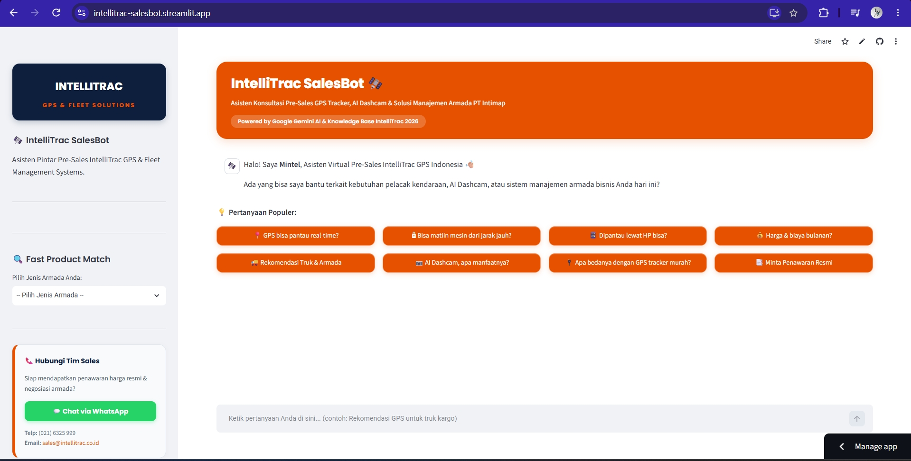

# 🛰️ IntelliTrac SalesBot

> **Final Project - Course: LLM-Based Tools and Gemini API Integration for Data Scientists**  
> 🌐 **Live Demo Web App**: [https://intellitrac-salesbot.streamlit.app/](https://intellitrac-salesbot.streamlit.app/)
>
> *Organized by Hacktiv8 & Supported by Google.org / AVPN*

---

## 📌 Overview



**IntelliTrac SalesBot** adalah aplikasi chatbot AI pre-sales berbasis web yang dirancang untuk PT Intimap (IntelliTrac Indonesia). Chatbot ini berfungsi sebagai asisten konsultasi yang cerdas bagi calon pelanggan yang tertarik dengan produk pelacak kendaraan (GPS Tracker), AI Dashcam (ADAS & DMS), serta sistem manajemen armada (Fleet Management System).

Chatbot ini diberi nama **"Mintel"**. Mintel bertugas memberikan rekomendasi produk sesuai jenis armada bisnis calon customer (truk logistik, truk reefer pendingin, truk semen, bus, hingga kendaraan operasional kantor) dan menjelaskan spesifikasi teknisnya, lalu mengarahkan calon customer ke Sales Executive resmi saat membutuhkan penawaran harga resmi (Sales Handoff).

---

## ✨ Fitur Utama

- 🧠 **Powered by Google Gemini AI**: Memanfaatkan model LLM **Gemini 3.5 Flash-Lite** (dipadukan dengan sistem *multi-model fallback* berurutan: **Gemini 3.1 Flash-Lite**, **Gemini 3.7 Flash**, **Gemini 3 Flash**, **Gemini 3.6 Flash**, **Gemini 3.5 Flash**) supaya respons bahasa alami (NLP) tetap cepat dan stabil walau ada gangguan di salah satu model. Urutannya disusun dari model tercepat berdasarkan hasil pengukuran waktu respons.
- 📚 **Integrated Knowledge Base**: Konteks jawabannya diambil langsung dari dokumen resmi PT Intimap, Katalog Produk 2026, serta Matriks Spesifikasi & Fitur Perangkat (VT-45 Lite, VT-45, JC261, JC450, OBD-II, dan lain-lain).
- 🤝 **Sales Handoff Card**: Ketika calon customer mulai menanyakan harga resmi atau niat membeli, kartu kontak Sales Representative (WhatsApp & Email) langsung muncul otomatis.
- 🔍 **Fast Product Match**: Pada sidebar kiri, ada widget yang langsung merekomendasikan produk begitu calon pelanggan memilih jenis armadanya.
- 💡 **Quick Prompt Chips**: Sederet pertanyaan populer yang bisa langsung diklik, jadi calon customer dimudahkan karena tidak perlu mengetik dari nol untuk memulai obrolan.
- 🎨 **Modern & Responsive UI**: Dibangun di atas Streamlit dengan tema warna khas IntelliTrac, Navy Blue & Orange.

---

## 🏗️ Struktur Proyek

```
Final_Project_IntelliTrac_SalesBot/
│
├── app.py                  # Aplikasi utama Streamlit (UI & Gemini API Handler)
├── requirements.txt        # Daftar dependensi Python
├── .env.example            # Template konfigurasi API Key Google Gemini
├── .gitignore              # Mengabaikan file sensitif (.env)
├── README.md               # Dokumentasi lengkap proyek
├── LICENSE                 # Lisensi proyek
├── UI_Screenshot.png       # Screenshot antarmuka aplikasi
│
├── .streamlit/
│   ├── config.toml         # Konfigurasi tema & pengaturan Streamlit
│   └── secrets.toml.example # Template konfigurasi Google Sheets (opsional)
│
├── docs/
│   └── PROJECT_ARTIFACTS.md # Catatan artefak & dokumentasi tambahan proyek
│
└── knowledge/              # Knowledge Base Dokumen Perusahaan & Produk
    ├── company_profile.md  # Profil PT Intimap & IntelliTrac Indonesia
    ├── catalogue_2026.md   # Deskripsi & spesifikasi katalog produk 2026
    ├── product_features.md # Tabel matriks perbandingan fitur & perangkat
    ├── faq.md               # Panduan jawaban internal (blank spot, trial/POC)
    └── faq_website.md       # FAQ publik website, sudah dikoreksi untuk chatbot
```

---

## 🚀 Cara Menjalankan Aplikasi Secara Lokal

### 1. Prasyarat
- Python 3.10 atau versi yang lebih baru (kompatibel & teruji pada Python 3.10 - 3.14).
- Google Gemini API Key (bisa didapatkan gratis di [Google AI Studio](https://aistudio.google.com/)).

### 2. Kloning Repositori & Install Dependensi
```bash
git clone https://github.com/sa-yudha/IntelliTrac-SalesBot.git
cd IntelliTrac-SalesBot

# Install dependensi
pip install -r requirements.txt
```

### 3. Konfigurasi Environment Variables (Otomatis & Aman)
API Key terkonfigurasi secara otomatis dan aman via file `.env` (untuk pengujian lokal) atau via **Streamlit Cloud Secrets** (untuk live web app), sehingga calon pelanggan/user **tidak perlu menginputkan API Key secara manual** di antarmuka web.

Untuk pengujian lokal, buat file `.env` di root folder:
```env
GOOGLE_API_KEY=AIzaSy...
```

### 4. Jalankan Aplikasi Streamlit
```bash
streamlit run app.py
```
Aplikasi akan secara otomatis terbuka di browser pada alamat `http://localhost:8501`.

---

## 📋 Informasi Submisi Final Project (Hacktiv8)

- **Nama Project**: IntelliTrac SalesBot
- **Target Pengguna**: Calon customer dari IntelliTrac GPS Tracker & Fleet Management Systems
- **Manfaat Chatbot**: Memberikan edukasi produk, kualifikasi kebutuhan armada, dan konsultasi pre-sales sebelum di-handoff ke sales person resmi dari tim IntelliTrac.

---

## 📄 Lisensi & Hak Cipta
© 2026 PT Intimap / IntelliTrac Indonesia & Yudha. Dikembangkan untuk Hacktiv8 Final Project.
